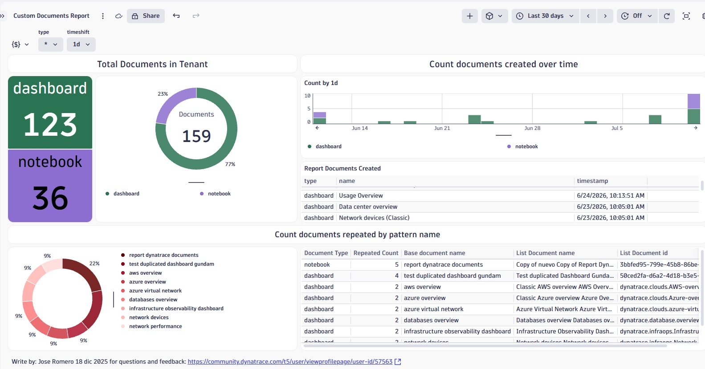
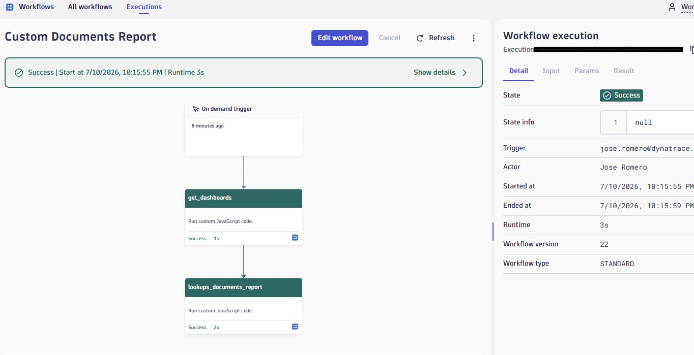

# 📊 Custom Documents Report — Dashboard + Workflow

## ¿Qué es?
Un dashboard que hace un **censo/inventario de los documentos del tenant** (dashboards y notebooks): cuántos hay, cuándo se crearon (serie temporal), su distribución por tipo y la **detección de duplicados** por patrón de nombre ("Copy of ...").

El dashboard **NO consulta la API directamente**: lee de una **lookup table en Grail** (`/lookups/documents_report`) que es **poblada por un workflow** que corre a diario. Por eso el tablero **solo funciona después** de ejecutar el workflow al menos una vez.

## Arquitectura / cómo funciona

```
[Workflow diario]
   task get_dashboards          -> lista TODOS los documentos vía documentsClient.listDocuments (adminAccess)
   task lookups_documents_report -> convierte a JSONL y lo sube como lookup table a Grail
                                    (/platform/storage/resource-store/v1/files/tabular/lookup:upload)
        |
        v
[Lookup table /lookups/documents_report]
        |
        v
[Dashboard Custom Documents Report]  -> load "/lookups/documents_report" | ...
```



## Archivos en esta carpeta
- `Custom Documents Report.json` — el dashboard (importar en la app **Dashboards**).
- `custom-documents-report.workflow.json` — el workflow (importar en la app **Workflows**).
- `img/` — capturas de referencia.

## Requisitos previos
- Tenant Dynatrace SaaS (Grail habilitado, apps **Dashboards** y **Workflows** instaladas).
- Permisos para crear/ejecutar workflows y para escribir lookup files en Grail (ver sección Permisos).

## 🔐 Permisos requeridos para el WORKFLOW

El workflow ejecuta 2 tasks de tipo *Run JavaScript*, cada una necesita scopes distintos. Configúralos en **Account Management** (policies) y también habilítalos en **Workflows > Settings > Authorization settings** (Primary/Secondary permissions).

**Permisos generales de Workflows / AutomationEngine:**

| Permiso (scope) | Para qué |
|---|---|
| `app-engine:apps:run` | Listar apps y leer bundles (acceso base a Workflows). |
| `app-engine:functions:run` | Usar el function-executor (ejecutar el Run JavaScript). |
| `automation:workflows:read` | Ver workflows. |
| `automation:workflows:write` | Crear/editar el workflow y su trigger programado. |
| `automation:workflows:run` | Ejecutar el workflow manualmente o por schedule. |

**Task `get_dashboards` — lista los documentos (usa `documentsClient.listDocuments` con `adminAccess: true`):**

| Permiso (scope) | Para qué |
|---|---|
| `document:documents:read` | Leer documentos del tenant. |
| `document:documents:admin` | Requerido porque el código usa `adminAccess: true` para listar documentos de TODOS los usuarios. |

**Task `lookups_documents_report` — sube la lookup table al Resource Store de Grail:**

| Permiso (scope) | Para qué |
|---|---|
| `storage:files:write` | Subir/crear la lookup table (`lookup:upload`, con `overwrite: true`). |
| `storage:files:read` | Leer/validar la lookup table en Grail. |
| `storage:files:delete` | (Recomendado) permite el `overwrite` de una tabla existente. |

> 💡 El **actor** del workflow (usuario o service user que lo ejecuta) debe tener asignados TODOS estos permisos. Si falta alguno, la task falla con **403 Forbidden**. Se recomienda usar un **service user** dedicado con exactamente estos scopes (principio de mínimo privilegio) y restringir `storage:files:*` al prefijo `/lookups/documents_report` cuando sea posible.

## ▶️ Procedimiento de instalación (paso a paso)

### Paso 1 — Importar el dashboard
1. Abre la app **Dashboards** en tu tenant.
2. Menú **Upload / Import** y selecciona `Custom Documents Report.json`.
3. Guarda. El dashboard mostrará "sin datos" hasta que exista la lookup table.

### Paso 2 — Importar el workflow
1. Abre la app **Workflows**.
2. Importa `custom-documents-report.workflow.json` (o crea un workflow nuevo y pega las 2 tasks *Run JavaScript*).
3. Revisa el **trigger**: viene programado a las `00:00` en zona horaria `America/Asuncion`. Ajústalo a tu preferencia.



### Paso 3 — Configurar permisos / actor
1. Asigna al actor del workflow los scopes de la sección **Permisos**.
2. En **Workflows > Settings > Authorization settings**, habilita los permisos primarios/secundarios listados.

### Paso 4 — Primera ejecución (poblar la lookup table)
1. Ejecuta el workflow manualmente (**Run**).
2. Verifica que ambas tasks terminen en **OK**. La task `lookups_documents_report` devuelve `success: true` y `totalRecords`.
3. Confirma la creación de la tabla ejecutando en un Notebook / Investigator:
   ```
   load "/lookups/documents_report" | limit 10
   ```

### Paso 5 — Ver el dashboard
Vuelve a **Dashboards** y abre *Custom Documents Report*. Ya debe mostrar el conteo por tipo, la serie temporal, el donut y la tabla de duplicados.

## ⚙️ Consideraciones importantes
- **Orden de dependencia**: el dashboard depende 100% de la lookup table. Sin la primera ejecución del workflow, todos los tiles saldrán vacíos.
- **`overwrite: true`**: cada ejecución reemplaza la tabla completa (las lookup tables se sustituyen íntegras, no se hace append).
- **Límites del Run JavaScript**: timeout de 120 s, 256 MB de RAM, script ≤ ~5 MB. `listDocuments` pagina de a 1000; en tenants con MUCHOS documentos vigila el timeout.
- **`adminAccess: true`**: lista documentos de todos los usuarios; por eso exige `document:documents:admin`. Si solo quieres los tuyos, quítalo y bastará `document:documents:read`.
- **Zona horaria del trigger**: por defecto `America/Asuncion` a las 00:00; ajústala según tu región.
- **Ruta de la lookup**: `/lookups/documents_report` (respeta las reglas de path de Grail: inicia con `/lookups`, mínimo dos `/`, solo alfanuméricos, `-`, `_`, `.`, `/`).
- **Variables del dashboard**: `$type` (dashboard/notebook), `$timeshift` (1m/1h/1d/7d) y `$documents_copy` (detección de duplicados). Se cargan desde la misma lookup.
- **No subir secretos**: el JSON del workflow no contiene tokens ni URLs sensibles.

## 🖼️ Capturas de referencia

> Las imágenes en `img/` documentan visualmente el dashboard y el workflow.
> Coloca capturas adicionales en esa carpeta y referéncialas aquí.

Imágenes sugeridas:
- `img/dashboard-overview.png` — vista general del dashboard con datos reales.
- `img/workflow-tasks.png` — las 2 tasks del workflow en estado Success.
- `img/permissions.png` — configuración de permisos / Authorization settings.
- `img/lookup-verify.png` — verificación de la lookup en Notebook.

## Créditos
Creado por **Jose Romero** — jose.romero@dynatrace.com · Aporte a la comunidad Dynatrace.
